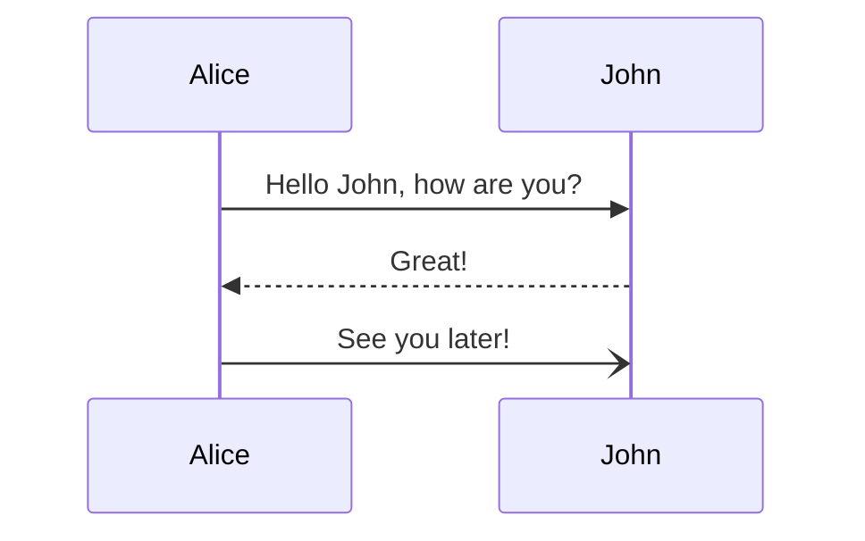
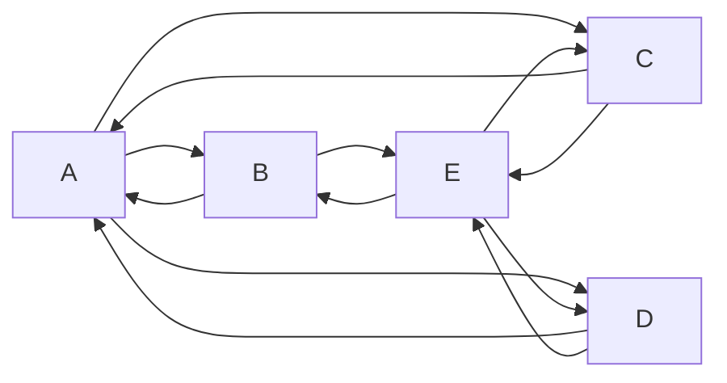

# Python Project Initialization

- [Python Project Initialization](#python-project-initialization)
  - [1. 프로젝트 생성](#1-프로젝트-생성)
  - [2. pip업데이트](#2-pip업데이트)
  - [3. Streamlit](#3-streamlit)
    - [설치](#설치)
    - [구동](#구동)
  - [4. FastAPI](#4-fastapi)
    - [설치](#설치-1)
    - [실행](#실행)
  - [logger](#logger)
    - [설치](#설치-2)
    - [사용](#사용)
  - [Test](#test)
  - [설치](#설치-3)
  - [VSCODE에서 가상 환경 실행](#vscode에서-가상-환경-실행)
    - [터미널 환경 설정](#터미널-환경-설정)
    - [Python Interpreter 설정](#python-interpreter-설정)
    - [터미널 열어서 확인](#터미널-열어서-확인)
  - [라이브러리 오프라인 설치](#라이브러리-오프라인-설치)
    - [온라인 설치](#온라인-설치)
    - [오프라인 설치](#오프라인-설치)
    - [확인](#확인)
  - [참고 링크](#참고-링크)

## 1. 프로젝트 생성

- 희망하는 위치에 프로젝트 디렉토리를 만든다.

  ```cmd
    c:\>mkdir project_1(enter)
    c:\>cd project_1(enter)
    c:\project_1>
  ```

- python 가상환경 만들기

  > c:\project_1>python -m venv pro_api

  - python -m venv -> 파이썬 모듈 중 venv를 사용한다.
  - pro_api -> 생성할 가상환경 이름
  - 진행 후 pro_api디렉토리가 생성된다.

  ```cmd
    c:\project_1> cd pro_api\Script(enter)
    c:\project_1\pro_api\Script> activate(enter)
    (pro_api) PS c:\project_1\pro_api\Script
  ```

  - **activate** -> 가상환경 사용 시작
  - 만약 가상환경에서 나오기 위해서는 **deactivate**를 입력 하면 된다.

## 2. pip업데이트

```
python -m pip install --upgrade pip
```

## 3. Streamlit

### 설치

> pip install streamlit

### 구동

> streamlit run myfile.py

## 4. FastAPI

### 설치

> pip install fastapi  
> pip install "uvicorn[standard]"

### 실행

> uvicorn main:app --reload --port=80

- "server.app:app" server폴더 않에 app파일안에 app 변수를 뜻한다.
- "main:app" main파일에 app변수를 뜻한다.

## logger

### 설치

> pip install loguru

### 사용

> from loguru import logger
>
> logger.info("message")

## Test

## 설치

```
pip install pytest pytest-asyncio httpx
```

## VSCODE에서 가상 환경 실행

### 터미널 환경 설정

- Ctrl + Shift + P 입력 후 Terminal: Select Default Profile 선택
- Command Prompt 선택

### Python Interpreter 설정

- Ctrl + Shift + P 입력 후 Python: Select interpreter 선택
- 프로젝트 안에 있는 Python 선택(Global - 선택하면 안됨)

### 터미널 열어서 확인

- Ctrl + ` 입력 하여 프로프트 앞에 프로젝트 명 확인

## 라이브러리 오프라인 설치

### 온라인 설치

- 온라인 환경에서 필요 라이브러리를 설치 한다.
  > pip install lib_name
- 라이브러리 리스트 파일을 만든다.
  > pip freeze > requirements.txt
- 패키지를 다운로드 한다.
  - 여러 파일 다운
    > pip download -d ./offlib -r requirements.txt
  - 단일 파일 다운
    > pip download -d ./offlib lib_name
- offlib 디렉토리를 압축 한다.

### 오프라인 설치

- 온라인 설치에서 만든 requirements.txt 파일과 offlib 압축 파일을 프로젝트로 옮긴다.
- 압축 파일을 푼다.
- 라이브러리 설치
  - 여러 파일 설치
    > pip install --no-index --find-links="./" -r requirements.txt
  - 단일 파일
    > pip install --no-index --find-links="./" lib_name

### 확인

- pip list

## 참고 링크

[참고링크](https://velog.io/@hongjunland/FastAPI-%ED%86%B5%ED%95%A9%ED%85%8C%EC%8A%A4%ED%8A%B8-TestClient)





