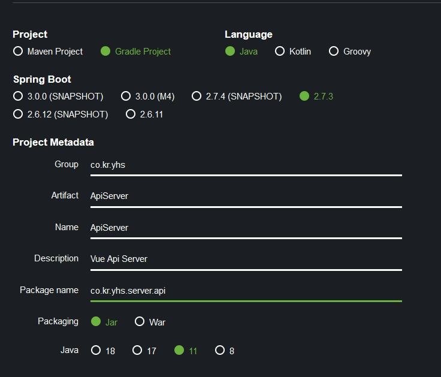

# Spring api server project 설정

## 목차

- [Spring api server project 설정](#spring-api-server-project-설정)
  - [목차](#목차)
  - [프로젝트 설정 파일 생성](#프로젝트-설정-파일-생성)

## 프로젝트 설정 파일 생성

1. <https://start.spring.io/> 접속  
   
   - Gradle Project 선택
   - Java 선택
   - Group 입력
   - Artifact 입력
   - Name 입력
   - Desciption 입력
   - Package name 입력
   - Pagcking Jar 선택
   - Java 11 선택
2. Dependencies 추가  
   
   - Spring Boot DevTools
   - Lombok
   - String Web
   - Spring Data JPA
   - Spring Data JDBC
   - H2 Database
3. 파일 다운로드 후 압축 해제
4. IDE로 오픈
5. Gradle 설정
6. 설정

   - application.properties => application.yml 이름 변경

     - 내용 추가

       ```YML
       # DB 설정
       spring:
           h2:
               console:
                   enable: true
           datasource:
               url: jdbc:h2:mem:~/test
               driver-class-name: org.h2.Driver
               username: sa
       ```

       jdbc:h2:mem:~test -> 스프링이 구동시에 같이 db도 구동이 된다.
